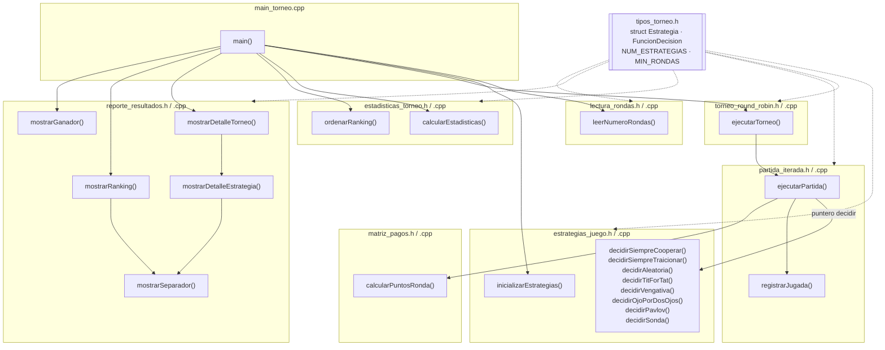
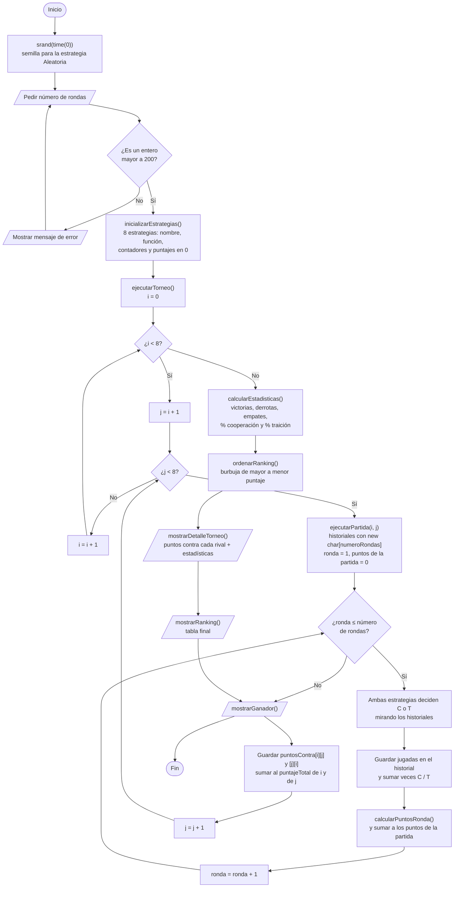

# Diagramas del programa

Ambos diagramas corresponden exactamente al código de este repositorio.
Se pueden ver renderizados en GitHub, en VS Code (extensión *Markdown Preview Mermaid Support*)
o pegando el bloque en https://mermaid.live para exportarlo como PNG/SVG al informe.

---

## 1. Diagrama de módulos y funciones

### 1.1 Qué contiene cada archivo

```text
tipos_torneo.h ............ NUM_ESTRATEGIAS, MIN_RONDAS (no hay máximo),
                            typedef FuncionDecision, struct Estrategia
                            (lo incluyen todos los demás módulos)

lectura_rondas.h/.cpp ..... leerNumeroRondas()

estrategias_juego.h/.cpp .. decidirSiempreCooperar()
                            decidirSiempreTraicionar()
                            decidirAleatoria()
                            decidirTitForTat()
                            decidirVengativa()
                            decidirOjoPorDosOjos()
                            decidirPavlov()          (propia)
                            decidirSonda()           (propia)
                            inicializarEstrategias()

matriz_pagos.h/.cpp ....... calcularPuntosRonda()

partida_iterada.h/.cpp .... ejecutarPartida()
                            registrarJugada()        (auxiliar interna del .cpp)

torneo_round_robin.h/.cpp . ejecutarTorneo()

estadisticas_torneo.h/.cpp  calcularEstadisticas()
                            ordenarRanking()

reporte_resultados.h/.cpp . mostrarDetalleTorneo()
                            mostrarDetalleEstrategia()
                            mostrarRanking()
                            mostrarGanador()
                            mostrarSeparador()       (auxiliar interna del .cpp)

main_torneo.cpp ........... main()
```

### 1.2 Quién llama a quién

```text
main()
├── srand(time(0))
├── leerNumeroRondas()                         [lectura_rondas]
├── inicializarEstrategias()                   [estrategias_juego]
├── ejecutarTorneo()                           [torneo_round_robin]
│   └── ejecutarPartida()   x 28 partidas      [partida_iterada]
│       ├── estrategia.decidir(...)  → una de las 8 funciones decidirXxx()  [estrategias_juego]
│       ├── registrarJugada()
│       └── calcularPuntosRonda()              [matriz_pagos]
├── calcularEstadisticas()                     [estadisticas_torneo]
├── ordenarRanking()                           [estadisticas_torneo]
├── mostrarDetalleTorneo()                     [reporte_resultados]
│   └── mostrarDetalleEstrategia()  x 8
│       └── mostrarSeparador()
├── mostrarRanking()                           [reporte_resultados]
│   └── mostrarSeparador()
└── mostrarGanador()                           [reporte_resultados]
```

### 1.3 Versión Mermaid



---

## 2. Diagrama de flujo del programa principal (`main()`)

Para la sección 4.4 del informe. Muestra los bucles reales del programa:
la validación de la entrada, el doble bucle del torneo (`i`, `j = i + 1`)
y el bucle de rondas de cada partida.


